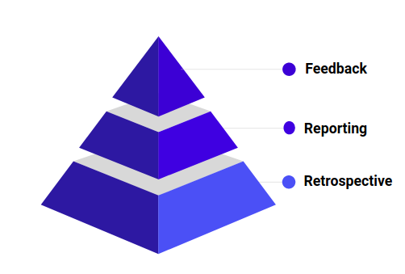
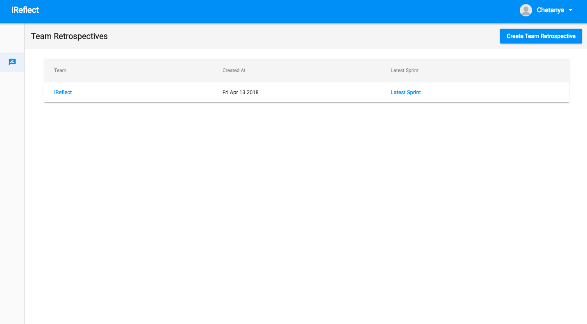
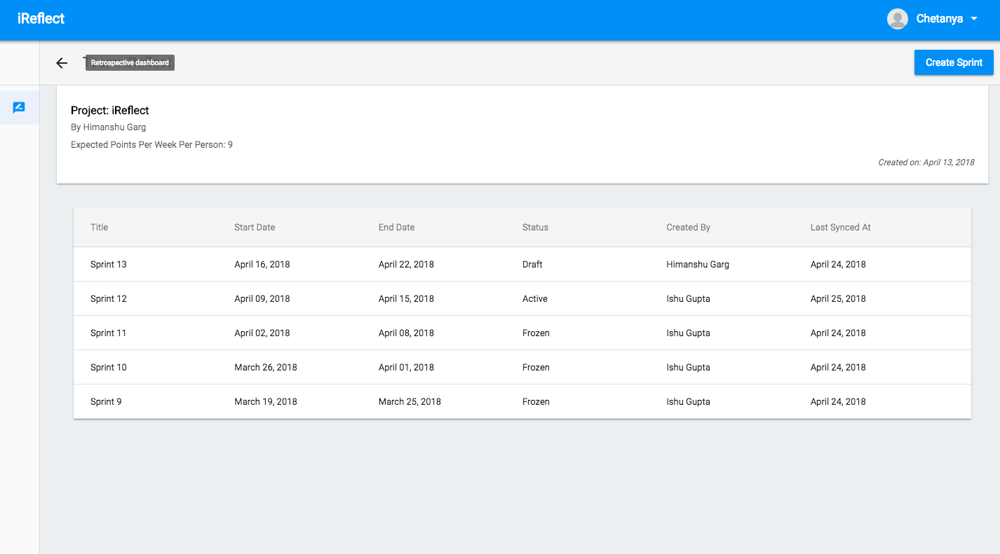
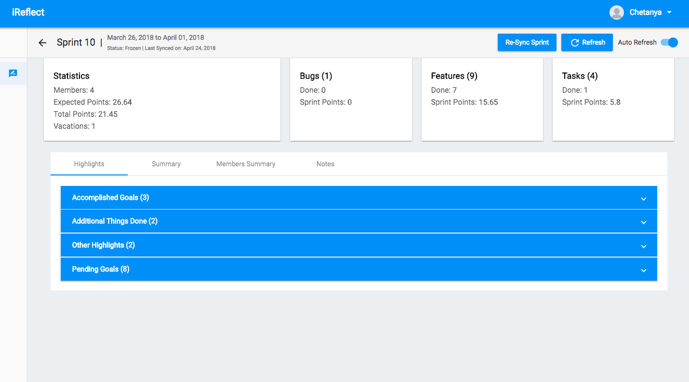
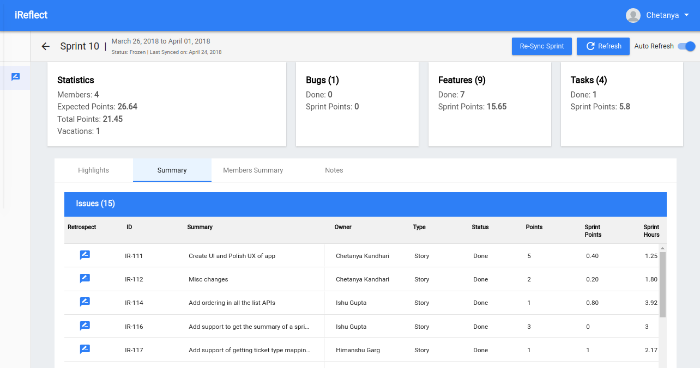
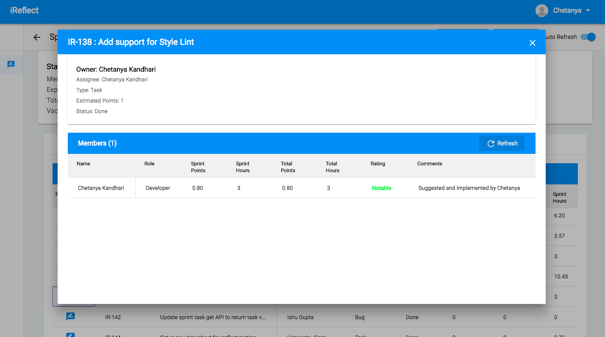
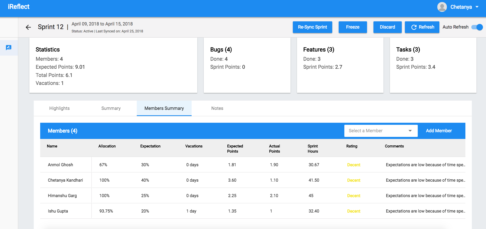
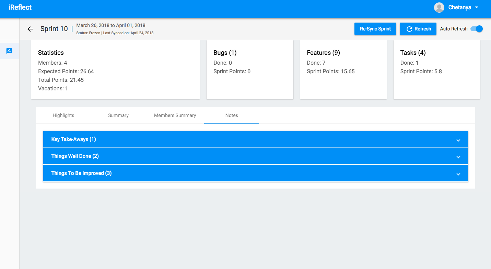

**iReflect** is a web application that enables continuous performance feedback and retrospective analysis for teams. It aims to build an extensible system that can provide integration with various development tools for pulling data required for performance analysis and generating growth path for a team and its members.

### Objectives
***

- #### For the Team
   - Track team’s performance not alone on basis of quantitative factors, but should include the qualitative performance required for the overall growth of the product, team and its members.
   - Define practical development and improvement goals and track growth against the various metrics defined.

- #### For the User
   - Provide an insightful analysis of user’s performance.
   - Track Feedback and Goals against user actions and performance to provide a 360 degree feedback.

- #### For Continuous Feedback and Reporting
   - Provide transparent feedback.
   - Provide continuous and early feedback.
   - Exhaustive feedback backed by various data points.
   - Easy to follow process which does not take up a lot of time.
   - Periodic reporting of growth of team/individual over periods.

### Three Step Plan
***

We started development with a 3 step plan:
1. **Retrospective**, which would be responsible for collecting the needed exhaustive performance data.
2. **Reporting**, which would be based on the processing of data points collected in the first process, and would be used to generate insights.
3. **Feedbacks**, which would be implemented as a simple interactive questionnaire which could be answered with the helps of generated insights and reports.

### What has been achieved?
***

- Automated and simplified the retrospective process.
- Allow team members to set and track goals and highlights for an individual or the team itself.
- Support to get data from JIRA and Google sheets along with skeleton support to link more tools to the system, which could include Pivotal Tracker, Toggl etc.
- Classification and collection of data in a form which could be processed further in later stages to generate useful insights.

### What is Next?
***

- **Reporting:**
   - Generate insights using trend analysis.
   - Automated goals creation based on various metrics.
   - Generate Team/Individual performance reports for analysis.
   - Present data collected from Retrospectives in the form of insightful charts and graphs.

- **Feedback Forms:**
   - Support feedback forms for flexible durations with a simple interface.
   - Use AI/ML to suggest data-driven feedback responses.
   - Provide insightful data accumulated using retrospectives, goals and highlights, to a user, while filling the feedbacks forms.

### How to Contribute?
***

1. #### [Reflect App](https://github.com/iReflect/reflect-app)
   API backend services implemented in [Golang](https://golang.org/) ([Gin framework](https://github.com/gin-gonic/gin)).

2. #### [Reflect Web](https://github.com/iReflect/reflect-web)
   Frontend web application implemented in [Angular](https://angular.io/).

    
### Screenshots
****

#### Retrospective
<dl>                            
<dt>Team Retrospectives
</dt>
<dd></dd>
<dd></dd>
<dt>Sprint Retrospectives
</dt>
<dd></dd>
<dt>Sprint
</dt>
<dd></dd>
<dd></dd>
<dd>
</dd>
<dd></dd>
<dd>
</dd>
<dd></dd><dd></dd>
<dd>
</dd>
<dd></dd>
<dd>
</dd>
<dd></dd>
</dl>

#### Feedback
   **WIP**
