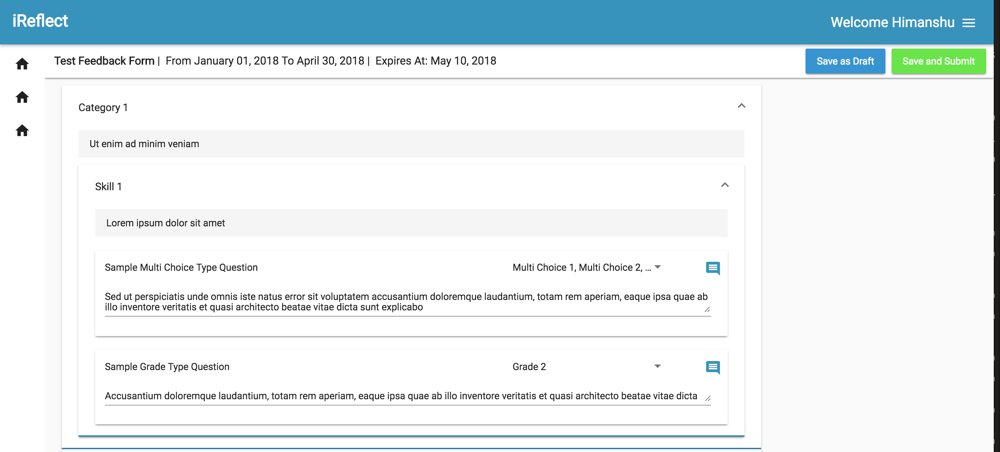
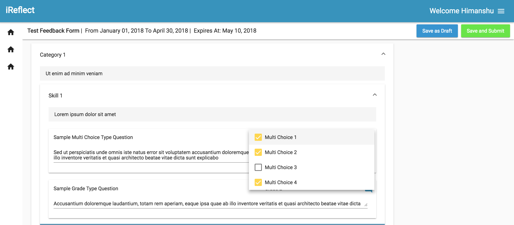
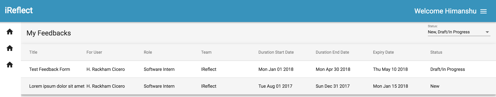
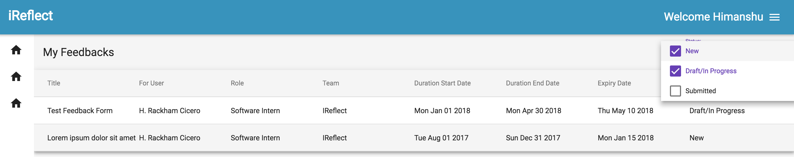

**iReflect** is an attempt to develop an open-source web-application to facilitate smooth feedback and retrospective 
analysis of a team.

### Components
***

1. #### [Reflect App](https://github.com/iReflect/reflect-app)
   API backend services implemented in [Gin framework](https://github.com/gin-gonic/gin)    

2. #### [Reflect Web](https://github.com/iReflect/reflect-web)
   Frontend web application implemented in [Angular](https://angular.io/)

    
### Screenshots
****

#### Feedback
<dl>                            
<dt>Interactive Feedback Form
</dt>
<dd></dd>
<dd></dd>
<dd>
</dd>
<dd></dd>
<dt>Feedback List
</dt>
<dd></dd>
<dd></dd>
<dd>
</dd>
<dd></dd>
</dl>

#### Retrospective
   **WIP**
